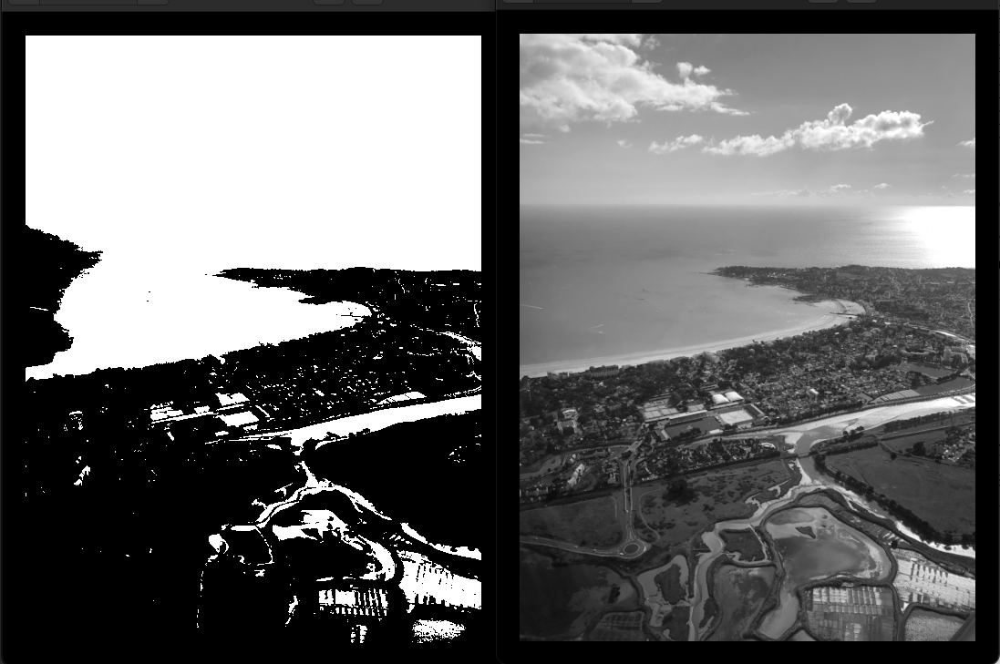
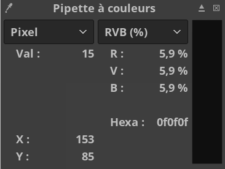
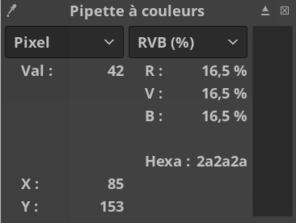
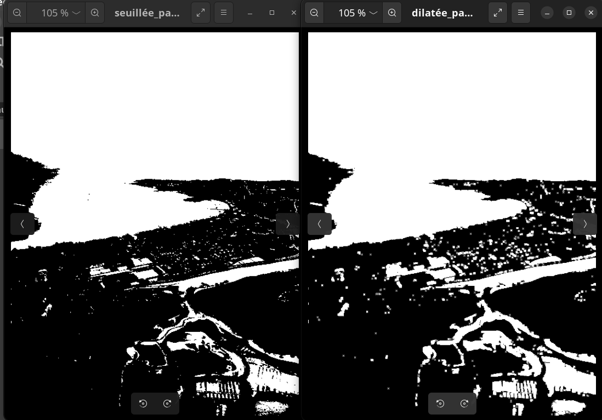
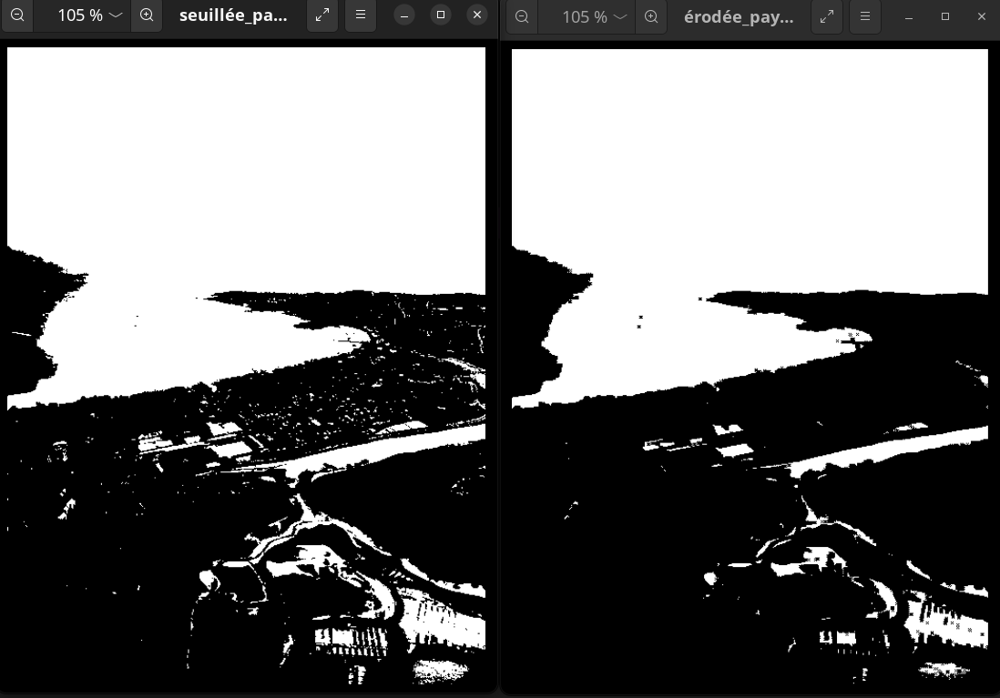
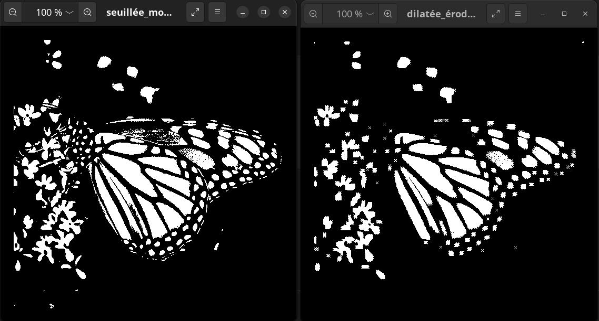
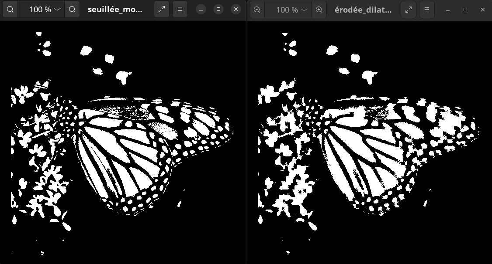

# Compte Rendu TP3 - Traitement d'Images et Morphologie

  

**Auteurs :** Jonas & Oumaima

**Date :** 2025

**Objectif :** Implémentation d'opérations de filtrage morphologique sur des images PGM

---

  

## Table des matières

  

1. [Introduction](#introduction)

2. [Architecture du projet](#architecture)

3. [Fonctionnalités implémentées](#fonctionnalités)

4. [Jeux d'essai et résultats](#jeux-dessai)

5. [Conclusion](#conclusion)

  

---

  

## 1. Introduction

  

Ce TP porte sur l'implémentation d'opérations de **morphologie** appliquées au traitement d'images en niveaux de gris au format PGM (Portable Gray Map).

  

Les opérations implémentées sont :

- **Seuillage** : binarisation d'une image
- **Différence de pixels** : calcul de distance entre deux images
- **Dilatation** : expansion des zones claires
- **Érosion** : réduction des zones claires
- **Ouverture** : érosion suivie d'une dilatation (suppression de petits détails clairs)
- **Fermeture** : dilatation suivie d'une érosion (suppression de petits trous sombres)

  

---

  

## 2. Architecture du projet


### Structure des fichiers

```

smp-tp3-jonas_oumaima/
├── image_report/ # Dossier d'image pour le rapport
├── main.cpp # Programme principal et tests
├── image.h # Structures de données (t_Image, structelem)
├── chargesauve.h/.cpp # Chargement/sauvegarde images PGM
├── outil.h/.cpp # Fonctions utilitaires (seuillage, diff)
├── filtragemorpho.h/.cpp # Opérations morphologiques
├── Makefile # Compilation du projet
└── rapport.MD # Ce rapport

```


### Structures de données

#### Structure t_Image

```cpp
struct t_Image

{
	int w; //largeur de l'image
	int h; //hauteur de l'image

	t_MatEnt im; //tableau des niveaux de gris de l'image
};

```

#### Structure structelem (élément structurant)

```cpp

struct structelem{

	int w; // Largeur de l'élément structurant
	int h; // Hauteur de l'élément structurant

	int x; // Position horizontale du centre de l'élément structurant
	int y; // Position verticale du centre de l'élément structurant

	t_MatBool val; // Valeurs prises par dans l'élément structurant (0 ou 1)

};
```

---

## 3. Fonctionnalités implémentées

### 3.1 Seuillage

**But :** Convertir une image en niveaux de gris en image binaire (noir et blanc).
**Code clé :**

```cpp

void seuillage(t_Image * image, unsigned int s){

	for (int i = 0; i < image->h; i++ ){ // On parcourt l'ensemble des pixels de l'image
		for (int k = 0; k< image ->w; k++){
			if (image->im[i][k] < s){ // On verifie si le niveau de gris est inferieur à la valeur de seuillage

				image->im[i][k] = 0; // Si oui : le niveau de gris passe à 0
			}
			else {
				image->im[i][k] = 255; // Sinon : le niveau de gris passe à 255
			}
		}
	}
}

```

### 3.2 Différence entre images

**But :** Calculer la valeur absolue de la différence de niveau de gris entre deux pixels.
**Application :** Comparaison d'images, détection de changements.
**Code clé :**

```cpp

int diff(t_Image *image1, t_Image *image2, int i, int j){
	assert(image1->h == image2->h && image1->w == image2->w); // On vérifie bien que les deux images sont de même taille
	int d = 0; // On initialise la valeur de la difference
	d = image1->im[i][j] - image2->im[i][j]; // on calcule la différence des niveau de gris
	if (d < 0){
		return -d; // On renvoie l'opposé de la valeur si d < 0, pour que ce soit positif
	}
	else {
		return d; // On renvoie la valeur si d > 0
	}
}

```


### 3.3 Dilatation

**But :** Agrandir les zones blanches de l'image.
**Principe :** Si l'élément structurant touche au moins un pixel blanc, le pixel central devient blanc.
**Effet visuel :** Les objets blancs grossissent, les trous noirs se rétrécissent.

**Code clé :**
``` cpp

    // Dilatation : On verifie si l'ES "tient" au moins un pixel allumé
    // Si oui, on allume le pixel de sortie concernée (i,k)

    for (int i = 0; i < imageEntree->h; i++ ){ // Déplacement sur la hauteur de l'image d'entrée
        for (int k = 0; k< imageEntree->w; k++){ // Déplacement sur la largeur de l'image d'entrée
            for (int m = 0; m < structure->h; m++){ // Déplacement sur la hauteur de l'élément structurant
                for (int l = 0; l < structure->w; l++){ // Déplacement sur la largeur de l'élément structurant

                    // Analyse de la valeur prise des pixels voisin du pixel (i,k)
                    if ((imageEntree->im[i-(structure->y)+m+1][k-(structure->x)+l+1] > 0) && structure->val[m][l] == 1){
            // Si au moins un pixel voisin est allumée et qu'en même temps le pixel de l'élément structurant vaut 1
                        imageSortie->im[i][k] = 255; // Le pixel concerné s'allume
                    }
                }
            }
        }
    }
```


### 3.4 Érosion

**But :** Réduire les zones blanches de l'image.
**Principe :** Si l'élément structurant ne recouvre que des pixels blancs, le pixel central reste blanc, sinon il devient noir.
**Effet visuel :** Les objets blancs rétrécissent, les petits détails disparaissent.

```cpp

// Érosion : pour chaque pixel, on vérifie si l'ES "tient" entièrement sur des pixels allumés.
// Si oui, on allume le pixel de sortie (i,k)

bool filtreactif = false; // Initialisation booléen de l'etat de l'ES, true si tous les pixels de l'ES sont allumé sur l'image d'enrée
for (int i = 0; i < imageEntree->h; i++ ){ // Déplacement sur la hauteur de l'image d'entrée
	for (int k = 0; k< imageEntree->w; k++){ // Déplacement sur la largeur de l'image d'entrée
		for (int m = 0; m < structure->h; m++){ // Déplacement sur la hauteur de l'ES
			for (int l = 0; l < structure->w; l++){ // Déplacement sur la largeur de l'ES
				if ((imageEntree->im[i-(structure->y)+m+1][k-(structure->x)+l+1] == 0) && structure->val[m][l] == 1){
		// Si au moins un pixels de l'ES n'est pas dans le même état que l'image d'entrée
					filtreactif = false; // Le pixel (i, k) n'est pas "validé"
					imageSortie->im[i][k] = 0; // Le pixel (i,k) ne vaut pas la peine d'être allumé
					break; // Arrêt du déplacement dans la largeur de l'ES (condition non validée)
				}
		// L'ES et l'image d'entree sont dans le même etat, le pixel (i,k) est validé
				else{
					filtreactif = true; // Validation du pixel pour continuer le déplacement dans l'ES
					imageSortie->im[i][k] = 255; // Allumage du pixel
				}
			}
			if (filtreactif == false){
			break; // Arrêt du déplacement dans la hauteur de l'ES (condition non validée)
			}
		}
	}
}

```
### 3.5 Ouverture (Érosion + Dilatation)

**But :** Supprimer les petits objets blancs et lisser les contours tout en préservant la taille globale.
**Application :** Suppression du bruit blanc.


### 3.6 Fermeture (Dilatation + Érosion)

**But :** Combler les petits trous noirs et lisser les contours.
**Application :** Suppression du bruit noir, connexion de composantes proches.


---


## 4. Jeux d'essai et résultats 

### 🧪 Test 1 : Seuillage d'image

**Objectif :** Vérifier la binarisation correcte d'une image.

#### Données d'entrée

- **Image :** `paysage.pgm` (papillon monarque, 512×512 pixels)
- **Valeur de seuil :** `120` 

#### Résultat attendu

Les pixels de niveau de gris < 120 deviennent noirs (0)
Les pixels de niveau de gris ≥ 120 deviennent blancs (255)


#### Résultat obtenu
<p align="center">
  
</p>

Réponse CMD :
```
SEUILLAGE DE L'IMAGE :

Nom de l'image  : paysage
chargement terminé.
Taille de l'image : 500x667
Valeur de seuillage : 120
Sauvegarde de la version seuillée...
sauvegarde terminée.
```

**Fichier généré :** `seuillée_paysage.pgm`

#### ✅ Validation

- Image correctement binarisée
- Les contours du papillon sont préservés
- Le fond et les détails sont clairement séparés

---
### 🧪 Test 2 : Différence de pixels entre deux images

**Objectif :** Vérifier le calcul de différence entre deux images différentes.

#### Données d'entrée
- **Image 1 :** `moarch512x512.pgm` (papillon)
- **Image 2 :** `mri512x512.pgm` (IRM cérébrale)
- **Pixel testé :** (153, 85)

  

#### Résultat attendu

Via GIMP on recupère les valeur du pixel (153, 85) des deux images  :

Pour ```mri512x512.pgm``` et ```moarch512x512.pgm``` :


<p align="center">
  
  
</p>

  
$im1(153,85) = 42$ et
$im2(153,85) = 132$

$$ d = |im1(153,85) -im2(153,85) | = |42-132 | =  90 $$


#### Résultat obtenu

```

DIFFERENCE DE NIVEAU DE GRIS ENTRE DEUX IMAGES PAR PIXEL : 

Différence entre monarch512x512 et mri512x512 pour le pixel (153, 85)  :

monarch512x512.pgm  : chargement terminé.
mri512x512  : chargement terminé.

Taille moarch512x512.pgm : 512x512
Taille mri512x512.pgm : 512x512
La valeur absolue de la différence du niveaux de gris en (153, 85) est : 90


```

  

#### ✅ Validation

- Les deux images ont bien les mêmes dimensions (assertion validée)
- La fonction `diff()` retourne bien la difference positive des niveau de gris (90)
- Pas de dépassement de tableau


---

  

### 🧪 Test 3 : Dilatation avec élément structurant en croix

  

**Objectif :** Agrandir les zones blanches d'une image binaire.

  

#### Paramètres d'entrée

```
Définition de votre élément structurant en croix : 
Dimension de l'élément structurant : 3
Centre de l'élément structurant  : 
x : 1
y : 1
```
- **Image :** `paysage.pgm`
- **Seuil :** `120`
- **Élément structurant :** Croix de dimension 3×3
- **Centre :** (1, 1)


```

Structure de l'ES (visualisation) :

1 0 1 
0 1 0
1 0 1


```

  

#### Résultat obtenu

```
Dilatation : 

chargement terminé.
sauvegarde terminée.
Dilatée !
```

  

**Fichier généré :** `dilatée_paysage.pgm`

<p align="center">
  
</p>

#### ✅ Validation

- Les zones blanches sont agrandies
- On remarque le paterne de l'élément structurant 
- Les petits trous noirs sont comblés
- L'image reste dans les dimensions originales

---


### 🧪 Test 4 : Érosion avec élément structurant en croix


**Objectif :** Réduire les zones blanches d'une image binaire.


- **Image :** `paysage.pgm`
- **Seuil :** `120`
- **Élément structurant :** Croix de dimension 3×3
- **Centre :** (1, 1)


```

Structure de l'ES (visualisation) :

1 0 1 
0 1 0
1 0 1

```

  

#### Résultat obtenu

```
Erosion : 

chargement terminé.
sauvegarde terminée.
Erodée !
```

  

**Fichier généré :** `érodée_paysage.pgm`


<p align="center">
  
</p>
  

#### ✅ Validation

- Les zones blanches sont réduites
- Les petits détails blancs disparaissent
- Les contours sont érodés uniformément
- Les grandes structures restent visibles

#### ❓ Questionnement 

- Les trous noirs sont plus gros dans la grande zone blanche
- Il reste certains trous blancs dans les zones noires

---

  

### 🧪 Test 5 : Ouverture (suppression du bruit blanc)

  

**Objectif :** Éliminer les petits objets blancs parasites.

  

#### Paramètres
``` 
Nom de la seconde image : monarch512x512
chargement terminé.
Nouvelle valeur de seuillage :140
sauvegarde terminée.
Dimension du second élément structurant : 5
Centre du sencond élément structurant : 
x : 2
y : 2

```
- **Image :** `monarch512x512.pgm`
- **Seuil :** `140`
- **Élément structurant :** Croix de dimension 5×5
- **Centre :** (2, 2)

```
Structure de l'ES (visualisation) :

1 0 0 0 1
0 1 0 1 0
0 0 1 0 0
0 1 0 1 0
1 0 0 0 1
```

  

#### Processus

1. **Érosion** → supprime les petits détails
2. **Dilatation** → restaure la taille des grandes structures

  

#### Résultat obtenu

```
Ouverture : 

chargement terminé.
chargement terminé.
sauvegarde terminée.
chargement terminé.
sauvegarde terminée.
Ouverture effectuée !

```

  

**Fichier généré :** `dilatée_érodée_monarch512x512.pgm`

<p align="center">
  
</p>

#### ✅ Validation

- La plupart des pixels blancs isolés sont supprimés
- Forme globale du papillon préservée
- Contours légèrement lissés

#### ❓ Questionnement 

- Le paterne de l'ES est très visible
- Il reste quelques pixels blancs isolés

---


### 🧪 Test 6 : Fermeture (comblement des trous noirs)


**Objectif :** Combler les petits trous noirs dans les zones blanches.

  
#### Paramètres

- **Image :** `monarch512x512.pgm`
- **Seuil :** `140`
- **Élément structurant :** Croix de dimension 5×5
- **Centre :** (2, 2)

```
Structure de l'ES (visualisation) :

1 0 0 0 1
0 1 0 1 0
0 0 1 0 0
0 1 0 1 0
1 0 0 0 1
```
  

#### Processus

1. **Dilatation** → comble les petits trous

2. **Érosion** → restaure la taille originale

  

#### Résultat obtenu

```
Fermeture : 

chargement terminé.
chargement terminé.
sauvegarde terminée.
chargement terminé.
sauvegarde terminée.
Fermeture effectuée !

```

  

**Fichier généré :** `érodée_dilatée_monarch512x512.pgm`

<p align="center">
  
</p>

#### ✅ Validation

- Petits trous noirs comblés
- Zones blanches deviennent plus homogènes
- Contours légèrement arrondis
- Structure globale maintenue
  
---


## 5. Conclusion

  
### Objectifs atteints ✅


- ✅ Implémentation complète des opérations morphologiques
- ✅ Chargement/sauvegarde d'images PGM fonctionnels
- ✅ Élément structurant paramétrable
- ✅ Tests exhaustifs sur images réelles
- ✅ Résultats conformes aux attentes théoriques

---
## Annexes

### Compilation

```bash
make
```
### Exécution

```bash
./smp-tp3-jonas_oumaima
```

### Nettoyage

```bash
make clean
```


---

**Fin du rapport**